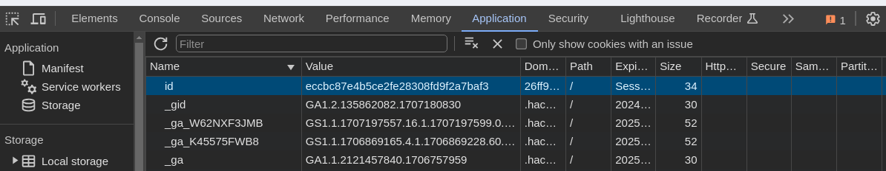
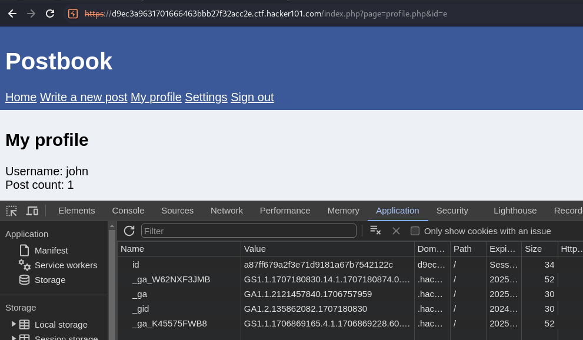
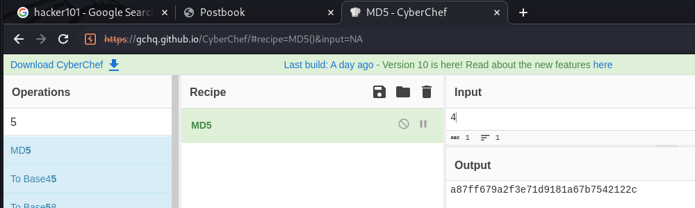
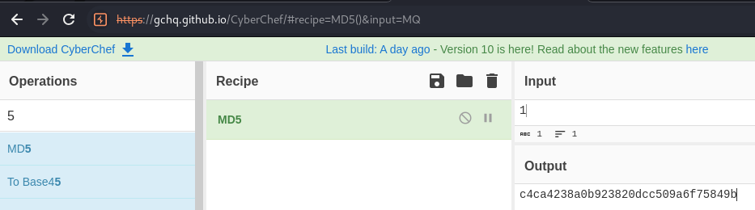
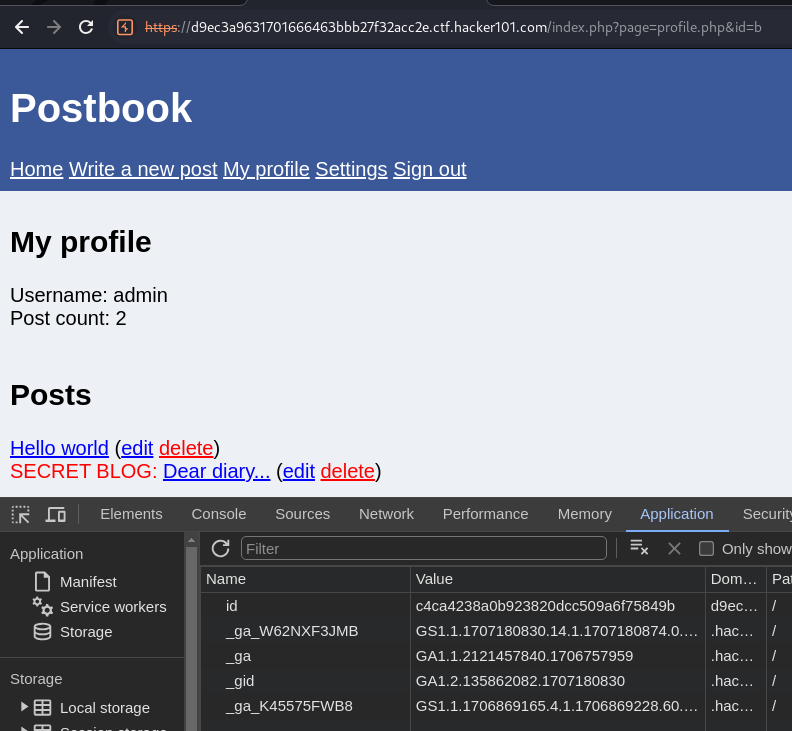

# Horizontal privilege escalation allows users to access other accounts by changing their id cookie

**Summary:**

Horizontal privilege escalation allows users to access the admin account and another user's account by changing their id cookie.

**Description:**

- Horizontal privilege escalation involves gaining the right of another user account with similar privileges. The accounts that were accessed had the same privileges as my user account. If there were more privileges with the admin account this would be a case of vertical privilege escalation.
- User's can become another account when they change the value of their id cookie with the hash of another user's id. If a user knows the id of another user that they want to gain access to, they only need to hash the id and change their id cookie with the hashed id. The user can create posts and delete posts as if they are that user.

Affected object: id cookies. 

**Severity:**

Critical

Vulnerability is easy to exploit and allows users to gain access to any user account.

**Steps to Reproduce:**

1. Viewing my user cookie there is an id a value which is the md5 hash of the user id. 

2. The id of my account is 4 which means the md5 hash for my id is a87ff679a2f3e71d9181a67b7542122c which I can confirm with CyberChef.

CyberChef: https://gchq.github.io/CyberChef/

3. Now I want to change to the admin account, I can change my ID to 1 with the hash c4ca4238a0b923820dcc509a6f75849b

4. Change the cookie data for id with the value of the new hash and refresh and click "My profile". You will now be the admin account.

**Impact:**

Knowing the hash of another user ID allows the user to easily access the account of another user where they can create and delete posts because they are using the other user's account.

**Recommended Mitigations:**

- Use strong, random and unique session ID cookies instead of using hashed user id cookies to authenticate users. 
- Servers must provide a random and unique session cookie for the user where only the user knows their session cookie and that session cookie is used to authenticate the user with the server. 
- A session cookie must be created after a successful login and must be deleted when the user is no longer logged in. 
- No two user's must share the same session cookie and session cookies must be random.
- Make sure when session cookies are implemented that they only exist for as long as the user is logged in and deleted after the user is logged out.
