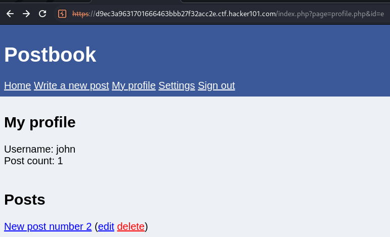
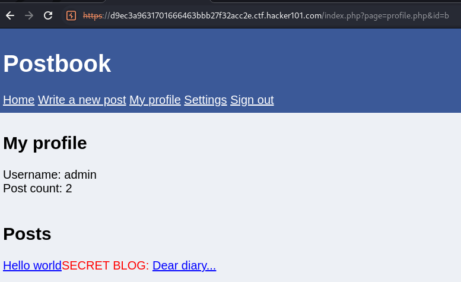
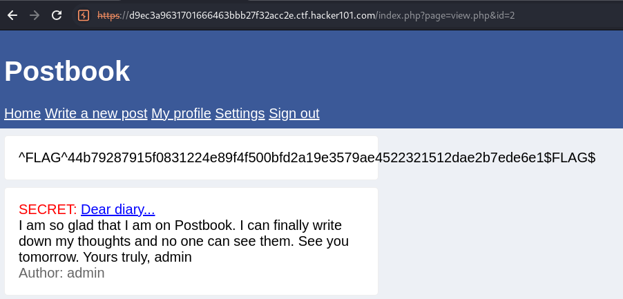

# IDOR vulnerability can be used to view profiles of other users and their secret posts

**Summary:**

IDOR vulnerability allows users to view the profiles of other users including their secret posts

**Description:**

- Insecure Direct Object Reference is an access control vulnerability that arises when an application accepts user-supplied input to access objects.
- Users can change their page id on the "My profile" page to view the profile of other users including the secret posts they have made.

Affected URL: https://26ff9ec30b121a410d3de36fcd980cd1.ctf.hacker101.com/index.php?page=profile.php&id=d

Affected Object: The URL containing the user page id

**Severity:**

Medium

Users can view secret data of other users but cannot change it.

**Steps to Reproduce:**

1. Go to My profile

2. Change the id to another user you believe may have a secret post. User id's are easy to enumerate through as they are predictable. At user id=b is the admin profile and you can see their secret post.

3. Click on the secret post to view

**Impact:**

Any user who can guess the id of another user's profile page can view their profile and any secret messages.

**Recommended Mitigation**

- Implement strong, random and unique session cookies and only allow the user with the correct session cookie to access their own profile and posts only.
- Use random and unique page ids so it's harder to enumerate through the different pages.
- Make sure when session cookies are implemented that they only exist for as long as the user is logged in and deleted after the user is logged out.
