# Brute force attack can be used to find login credentials

**Summary:**

Brute force attack can be used to find usernames and passwords of users including the admin.

**Description:**

Usernames of user's and their passwords can be discovered via the login page using the Burp Suite Turbo extension tool and wordlists found on SecLists. This is because there is no limit to the number of attempts that can be made when enumerating through usernames and the corresponding password. In this case we find the admin credentials and the admin login page.

Affected login: https://e85cc4eb9215475c840977c892c5c597.ctf.hacker101.com/login 

Affected object: The login form

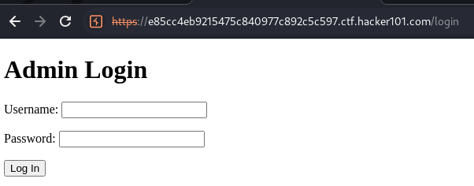

**Severity:**

High

Because admin credentials can be found and weak passwords can be set which can be found via a dictionary attack.

Otherwise P5:
Server Security Misconfiguration > Username/Email Enumeration > Brute Force

**Steps to Reproduce:**

1. Open Burp Suite and install the Burp Suite Turbo Extension under Extensions > BApp Store and search "turbo" and select and install "Turbo Intruder".

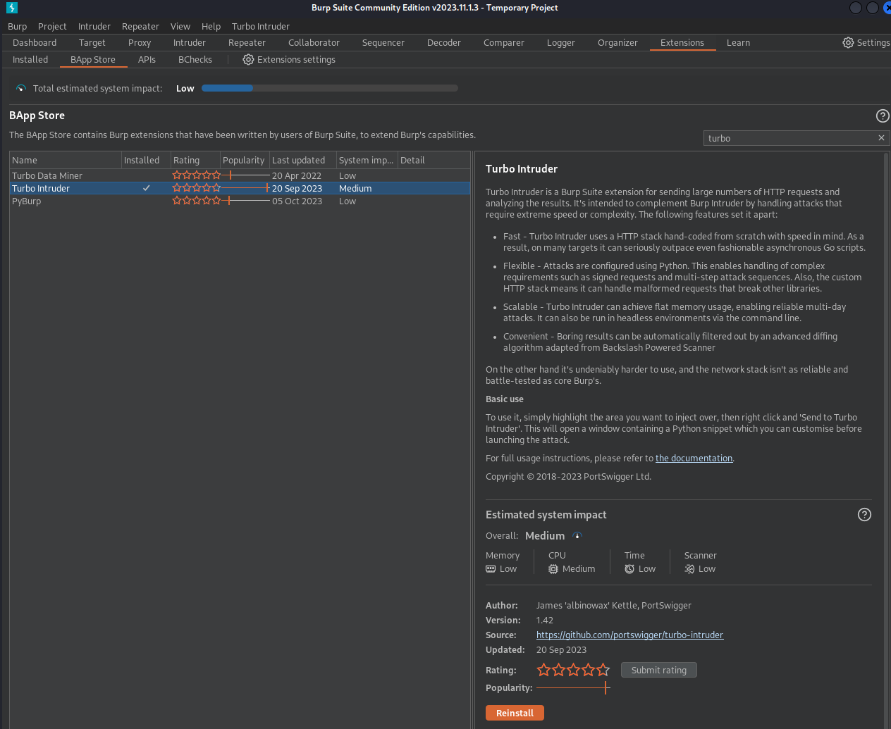

2. Go to GitHub and install SecLists. I saved mine to the /opt directory.
URL: https://github.com/danielmiessler/SecLists

Command: `git clone https://github.com/danielmiessler/SecLists.git`

3. Open a browser (in Burp Suite) and go to the login page and make an incorrect login attempt. I set the username to 'a' and the password to 'b'.
URL: https://e85cc4eb9215475c840977c892c5c597.ctf.hacker101.com/login 

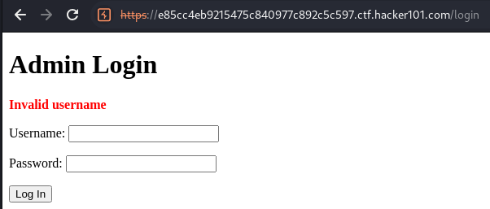

(Login page was found using the command: `gobuster dir -u "https://3021f8a666b8c948983ff5b80e92ae8d.ctf.hacker101.com/" -w /opt/SecLists/Discovery/Web-Content/common.txt`)

4. View the request in Burp Suite Proxy > HTTP history with the url /login and right click the request and click Extensions > Turbo Intruder > Send to Turbo Intruder.

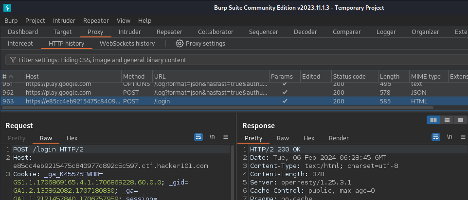

5. First we will enumerate the usernames using the `SecLists/Usernames/Names/names.txt` wordlist. Set up your Turbo Intruder like so:

Changes:
- change the username to `%s`
- change the file name to the location of your `/SecLists/Usernames/Names/names.txt` file.
- add the handle response as "`Invalid username`" as seen in the error message after an invalid attempt.

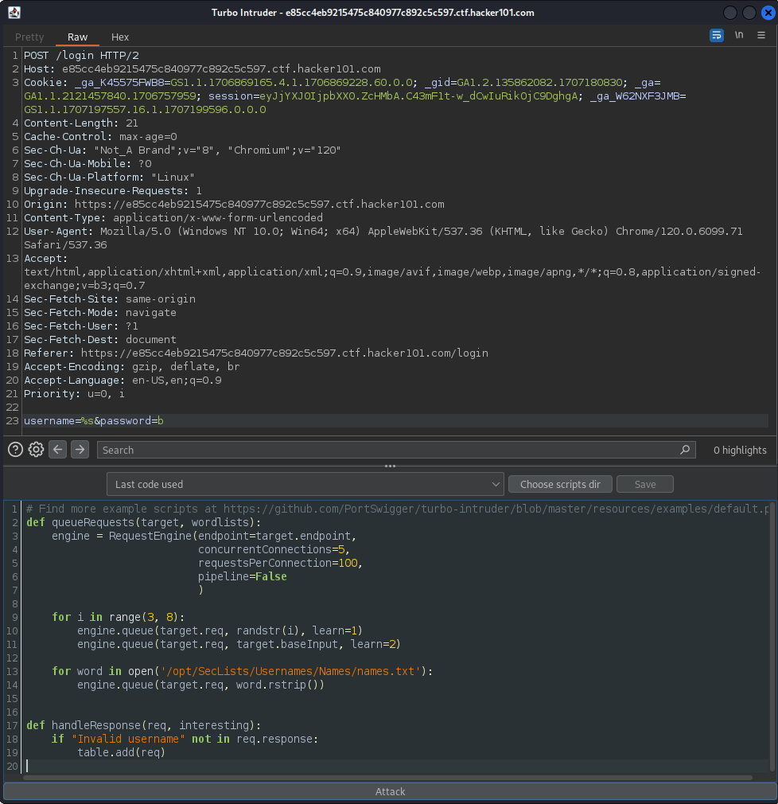

6. Click the "Attack" button at the bottom and wait for a username to be found. In this case the username '`roxane`' was found.

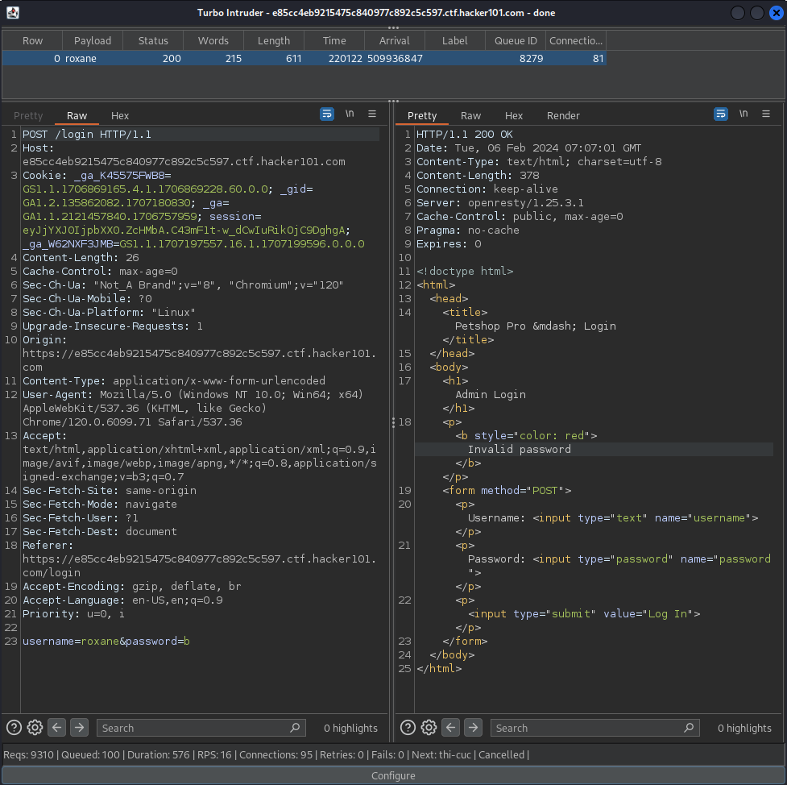

7. After a username has been found, in my case _, we must change Turbo Intruder to find the password of the user. Set up intruder like so:

Change:
- The username to the user we have found
- The password to `%s`
- The word list to `/SecLists/Passwords/Common-Credentials/10k-most-common.txt`
- Change 'Invalid username' to the new error message '`Invalid password`' which is seen in the response of finding the username 'roxane'.

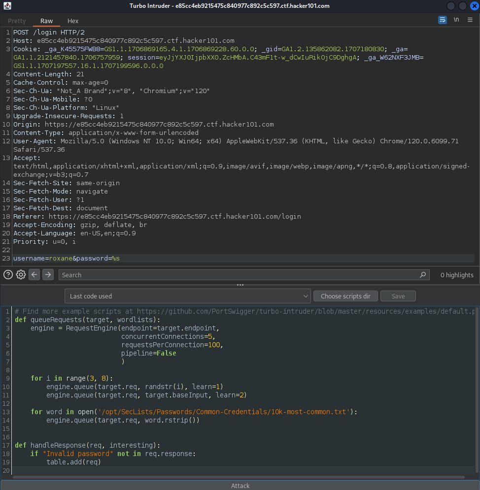

8. Click the "Attack" button at the bottom and wait for the password of '`roxane`' to be found. We find the password is '`support`'. We can see that the response is trying to redirect us because we found the correct credentials.

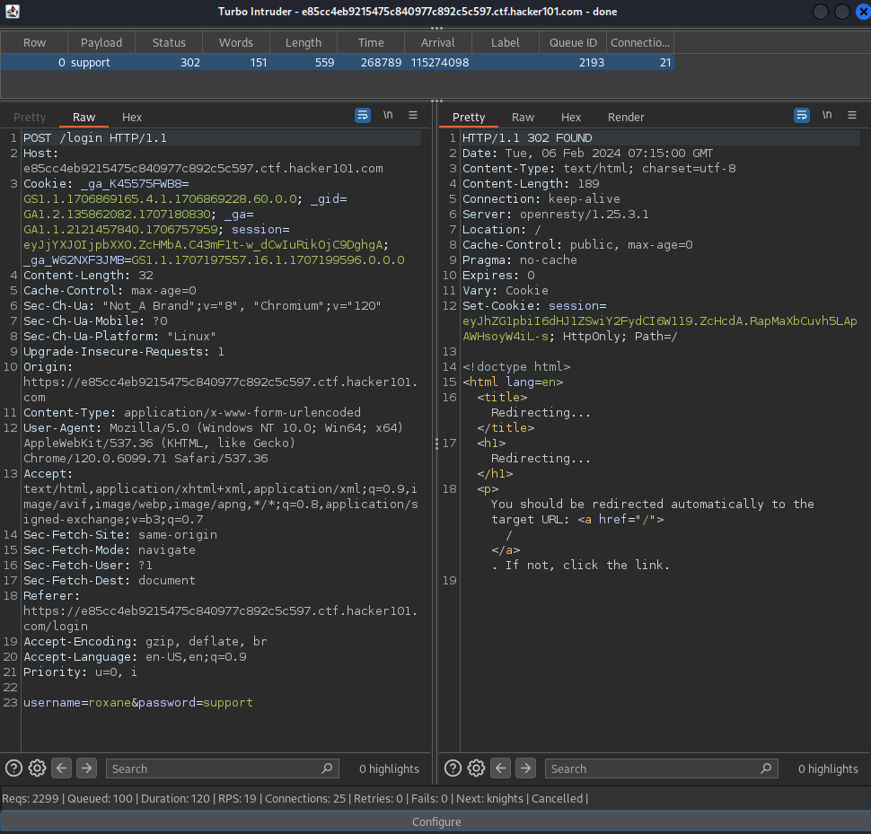

9. Now try the credentials in the Admin login. 

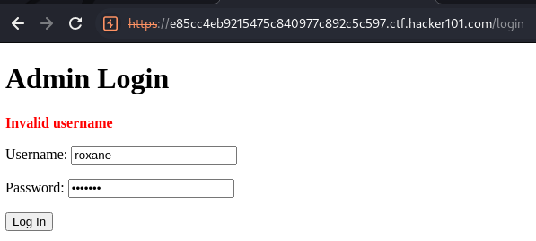

10. Now we are logged in and we seem to have admin privileges because we can also edit the items.

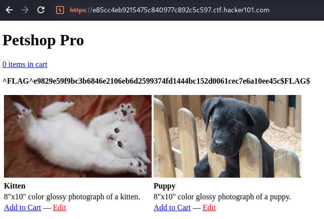
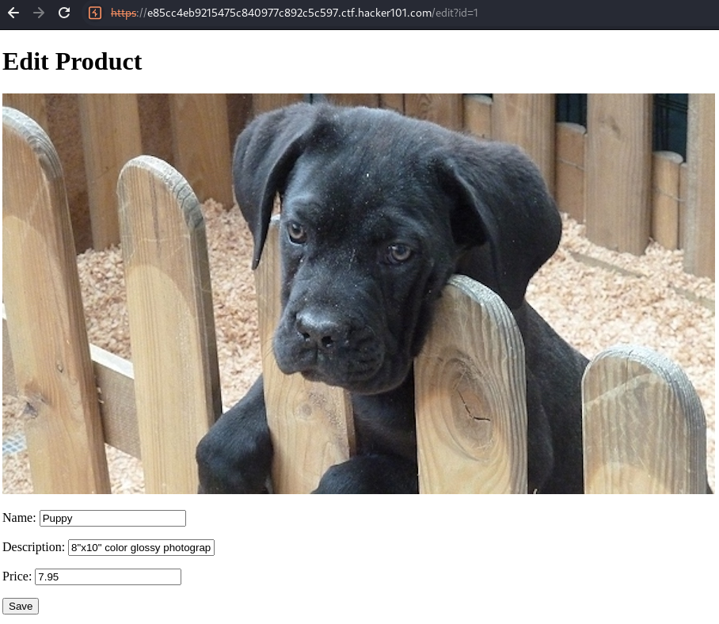

**Impact:**

User's can find the usernames and passwords of other user's without being limited to how many attempts we can make. This allows us to find the credentials to user accounts. In this case we find the credentials for the admin. We also found the admin login page.

**Recommended Mitigation**

- Error messages for an incorrect username or password must show the same error if either the username or password is incorrect. There must not be separate messages for the username or password being incorrect. For example, "Username/password is incorrect" is a valid error message. This prevents users from enumerating usernames of other user's.
- Limit the number of attempts users can make when logging into an account, and temporarily ban IP addresses that exceed the number of attempts.
- Rate limit the number of requests that are sent at once to prevent multiple login attempts.
- Make the url of the admin login page harder to guess than /login. Use something like admin-login-y12431.
