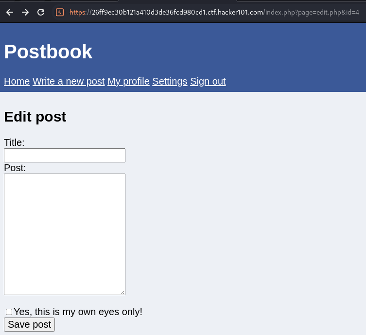
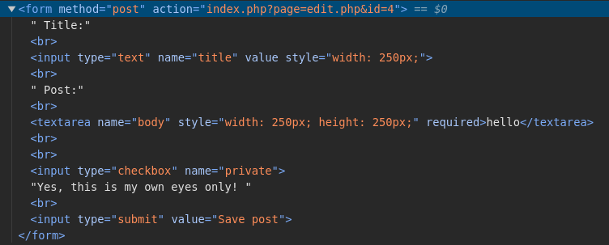
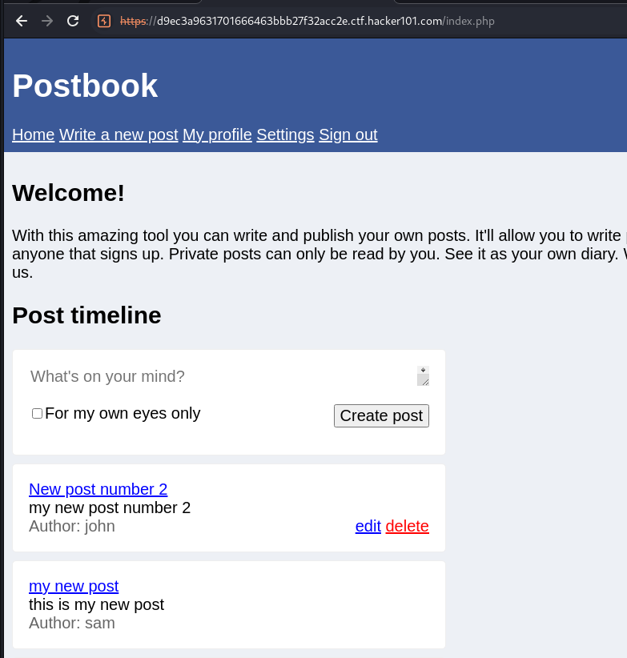
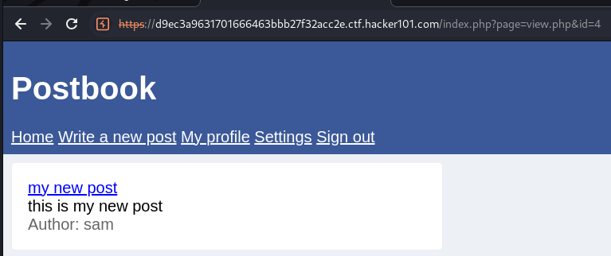
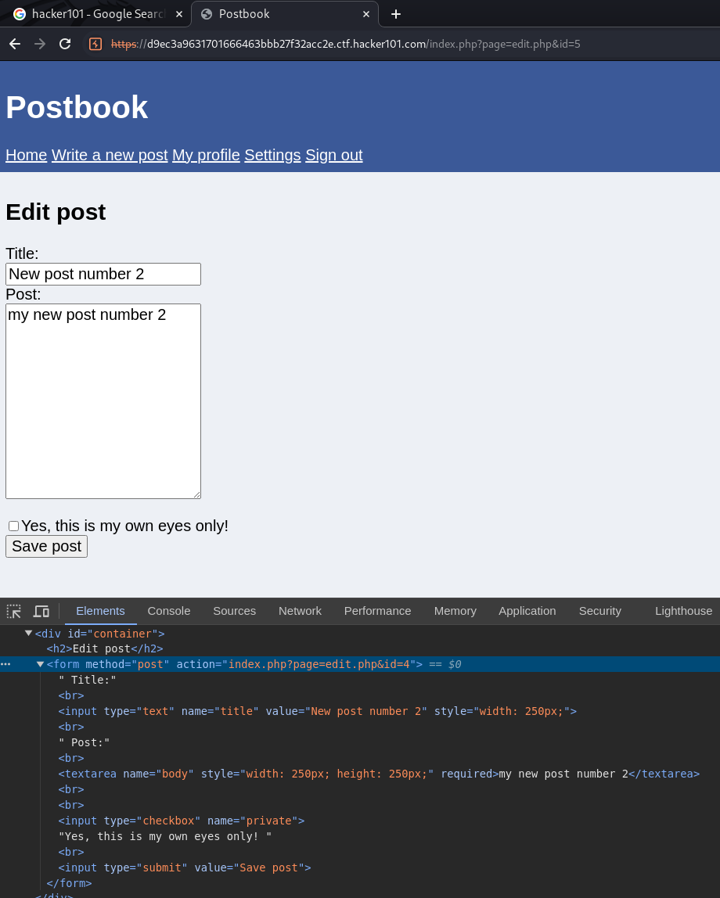
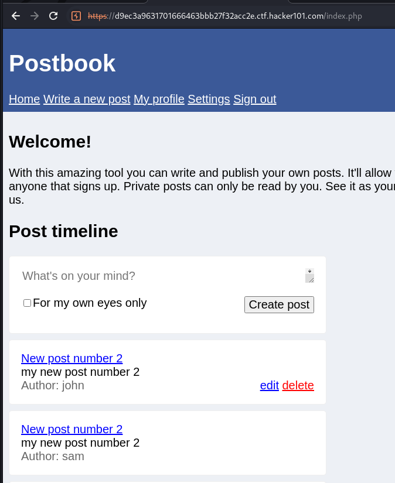

# Request forgery used to edit the posts of any user

**Summary:**

Users can edit posts on other user accounts without being logged into the other user account via request forgery.

**Description:**

- Request forgery is where a request is forged to perform actions that weren't originally intended.
- Users can edit the posts of other users by changing the id in the edit post form to a different post that exists. The user clicks edit on their post and they go to the form to where they use developer tools to inspect the form to edit the post and change the post id to the post id of another user's post. When they click save post they change the contents of the other user's post.

Affected URL: https://26ff9ec30b121a410d3de36fcd980cd1.ctf.hacker101.com/index.php?page=edit.php&id=4

Affected Object: Edit post form

**Severity:**

High

Users can edit whatever post they like if they have the id of the post they want to edit.

**Steps to Reproduce:**

1. Setup: I created two new user accounts, sam and john, so I would not violate terms and conditions. 

2. I created two posts for each of the user's 

3. View another user's post (eg sam). Notice how there is an id of the post.
This post has an id of 4.

3. Go to edit your post and add whatever you like in the title and message. Before saving the post view the source code with developer tools for the edit post form and notice how the action is to change the post for the specified id. Change the id to the id of another user's post and click send. 

4. Now when you go to the home screen to view the posts you can see sam has the same post as john.

**Impact:**

User's can make posts of other user's without being logged into the other user's account.

**Recommended Mitigations:**

- If post IDs need to be required when making changes to posts, a strong, random and unique session cookie must be allocated to every logged in user to verify the user is who they say they are before they can make a change to posts.
- Do not allow users to change another user's post based on the post id, they must be authenticated via the session cookie.
- The user must be verified by their session cookie first and must only be allowed to change their own posts, no other user.
- Make sure when session cookies are implemented that they only exist for as long as the user is logged in and deleted after the user is logged out.
